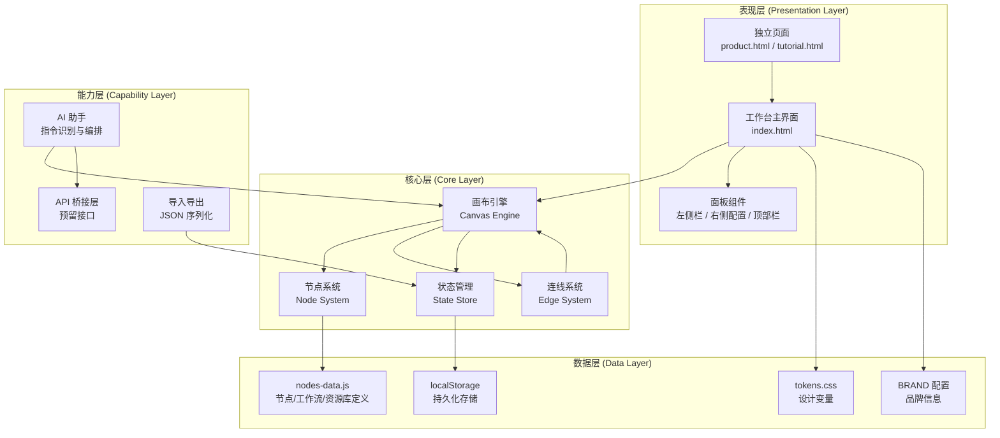

# 利建成AI工作台 — 功能架构说明与二次开发指南

> **版本**：v0.3.1 复刻版  
> **维护者**：阳江市锴利国际贸易有限公司  
> **最后更新**：2026-09-23

---

## 1. 项目概述

### 1.1 产品定位

**利建成AI工作台**（LiJianCheng AI Workbench）是一款面向跨境电商与内容创作团队的 **AI 可视化编排工作台**。用户通过拖拽节点、连线配置的方式，将各类 AI 模型（图像生成、视频生成、LLM、3D 生成等）串联成自动化工作流，无需编写代码即可完成从创意到交付的全链路创作。

核心场景覆盖：
- **电商详情页批量生成**：产品图 → 详情页大纲 → 配图 → 文案 → 组装
- **短视频/漫剧生产**：选题 → 大纲 → 分镜 → 视频生成 → 组装
- **办公文档自动化**：HTML / Word / Excel / PPT 多格式一键生成
- **供应链协同**：1688 找品 → 询盘 → 采集 → 多平台发布

### 1.2 技术栈

| 层级 | 技术选型 | 说明 |
|------|---------|------|
| 前端框架 | **原生 HTML / CSS / JavaScript**（无框架） | 零构建、零依赖，双击 index.html 即可运行 |
| 渲染引擎 | DOM + SVG | 画布渲染节点，SVG 绘制贝塞尔连线 |
| 样式方案 | CSS 自定义属性（Design Tokens） | 集中管理主题色、间距、圆角等变量 |
| 数据存储 | localStorage | 工作流、节点配置、资源库数据均存浏览器本地 |
| 原应用 | Tauri v2 (Rust) + Vue 3 | 原版桌面应用，前端资源经 zstd 压缩嵌入 exe |

### 1.3 与原 WfwCreator 的关系

| 维度 | 原 WfwCreator Agent | 利建成AI工作台（复刻版） |
|------|---------------------|--------------------------|
| 分发形态 | Windows 桌面安装包 (.exe) | 纯 Web 单页应用（可打包 PWA/Tauri） |
| 后端 | Tauri v2 + Rust 原生能力 | 无后端，纯前端模拟层（API 预留接口） |
| 前端框架 | Vue 3 | 原生 JS（数据结构完全兼容） |
| 节点数据 | 68 节点 / 13 分类 | **完全一致**，直接迁移 |
| 品牌 | 网蜂窝 / WfwCreator | 阳江市锴利国际贸易 / 利建成 / 小利助手 |
| 运行环境 | Windows 10+ | 任意现代浏览器（Chrome / Edge / Safari） |

> **迁移说明**：节点定义、工作流分类、资源库结构均从原应用的 `tutorial.html` 中提取，确保数据格式 100% 兼容。品牌配置集中在 `nodes-data.js` 的 `window.BRAND` 对象中，替换即可完成品牌切换。

---

## 2. 系统架构

### 2.1 整体架构图



### 2.2 模块划分

| 模块 | 职责 | 对应文件 |
|------|------|---------|
| **主界面** | 工作台整体布局、路由切换、全局事件 | `index.html` |
| **画布引擎** | 节点拖拽、连线绘制、视口缩放平移、网格背景 | `assets/js/app.js` |
| **节点数据** | 68 个节点的元数据定义、分类、品牌配置 | `assets/js/nodes-data.js` |
| **设计系统** | 颜色、间距、圆角、字体等全局样式变量 | `assets/css/tokens.css` |
| **工作台样式** | 布局、面板、节点卡片、连线等组件样式 | `assets/css/workbench.css` |
| **产品页** | 产品介绍与功能展示 | `pages/product.html` |
| **教程页** | 使用教程与节点说明 | `pages/tutorial.html` |

### 2.3 数据流

```
用户操作（拖拽/连线/配置参数）
        ↓
  事件监听（app.js 中的事件委托）
        ↓
  更新内存状态（nodes 数组 + edges 数组）
        ↓
  重渲染画布（DOM 操作 + SVG 路径重算）
        ↓
  持久化到 localStorage（防抖写入）
        ↓
  导入导出 → JSON 序列化 / 反序列化
```

**关键设计**：
- 所有画布状态保存在内存中的 `nodes` 和 `edges` 两个数组
- 每次状态变更触发 `render()` 重绘
- 防抖（300ms）自动保存到 localStorage，避免频繁写入
- 导入导出为标准 JSON 格式，可跨实例迁移

---

## 3. 目录结构说明

```
利建成AI工作台/
├── index.html                    # 工作台主界面（单页应用入口）
│
├── assets/
│   ├── css/
│   │   ├── tokens.css           # 设计变量（颜色/间距/圆角/字体）
│   │   └── workbench.css        # 工作台组件样式（布局/面板/节点/连线）
│   │
│   ├── js/
│   │   ├── nodes-data.js        # 68 节点数据 + 20 工作流分类 + 15 资源库 + BRAND 配置
│   │   └── app.js               # 主逻辑（画布引擎/节点系统/连线/持久化/AI助手）
│   │
│   └── img/
│       ├── logo.png              # 品牌 Logo（KaiLionCrafts 金色剪刀）
│       └── original-icon-256.png # 原始应用图标（备份参考）
│
├── pages/
│   ├── product.html              # 产品介绍页
│   └── tutorial.html             # 教程页
│
├── docs/
│   └── 架构说明与二次开发指南.md  # 本文档
│
└── README.md                     # 项目快速上手指南
```

### 各文件详细说明

| 文件 | 大小参考 | 作用 |
|------|---------|------|
| `index.html` | ~500 行 | 工作台主界面：左侧栏（节点库/工作流/资源库）、中间画布、右侧配置面板、顶部工具栏 |
| `tokens.css` | ~120 行 | CSS 自定义属性定义，全局设计 token 集中管理，修改主题只动这里 |
| `workbench.css` | ~800 行 | 工作台所有组件的具体样式：布局网格、节点卡片、连线SVG、面板、弹窗 |
| `nodes-data.js` | ~195 行 | 纯数据文件：`window.NODE_DATA`、`window.WORKFLOW_CATS`、`window.RESOURCE_LIBS`、`window.BRAND` |
| `app.js` | ~2000 行 | 核心逻辑：画布初始化、节点渲染、拖拽系统、连线算法、状态管理、localStorage 持久化、AI 助手指令解析 |
| `product.html` | ~300 行 | 独立产品介绍页，从工作台右上角导航进入 |
| `tutorial.html` | ~500 行 | 教程页：节点使用指南、工作流示例、常见问题 |

---

## 4. 节点体系

### 4.1 完整节点清单（68 节点 / 13 分类）

#### 输入类（4 节点，全部出厂可见）

| 节点名称 | type | 描述 | 出厂可见 |
|---------|------|------|:-------:|
| 提示词 | `promptNode` | 基础文本输入，把提示词传给下游图片/视频节点，是一切创作的起点 | ✅ |
| 图片 | `imageInputNode` | 上传本地图片作为参考或编辑素材，用于图生图、图像编辑、风格迁移 | ✅ |
| 视频 | `videoInputNode` | 上传本地视频，用于视频编辑、风格转换、视频内容理解 | ✅ |
| 文件 | `fileUploadNode` | 上传文件供 LLM 解析，支持图片 / PDF / Markdown / 音频 / 视频 | ✅ |

#### 图片生成类（9 节点，3 个出厂可见）

| 节点名称 | type | 描述 | 出厂可见 |
|---------|------|------|:-------:|
| Banana Pro | `imageGeneratorProNode` | 高画质出图，适合产品效果图、商业摄影风格、高质量插画 | ✅ |
| GPT Image | `gptImageGeneratorNode` | 多模态出图，支持图文结合创作与图像编辑、风格转换 | ✅ |
| 创意灵感 | `creativeInspirationNode` | 一句话快速生成多张灵感图，结果可放大、下载、一键收藏进素材库 | ✅ |
| Banana（快速版） | `imageGeneratorFastNode` | 响应更快，适合快速原型图与批量素材生成 | ❌ |
| SeeDream | `doubaoGeneratorNode` | SeeDream 图像生成线路 | ❌ |
| DALL-E | `dalleGeneratorNode` | OpenAI DALL-E 图像生成线路 | ❌ |
| Flux | `fluxGeneratorNode` | Flux 图像生成线路 | ❌ |
| Z-Image | `zImageGeneratorNode` | Gitee AI Z-Image 图像生成线路 | ❌ |
| Agnes Image | `agnesImageGeneratorNode` | Agnes Image 图像生成线路 | ❌ |

#### 视频生成类（8 节点，2 个出厂可见）

| 节点名称 | type | 描述 | 出厂可见 |
|---------|------|------|:-------:|
| Seedance | `seedanceGeneratorNode` | Seedance 视频生成线路 | ✅ |
| Omni | `omniGeneratorNode` | Google Omni 视频生成线路 | ✅ |
| MiniMax | `minimaxGeneratorNode` | MiniMax 视频生成线路 | ❌ |
| Grok Video | `grokGeneratorNode` | xAI Grok 视频生成线路 | ❌ |
| Sora | `videoGeneratorNode` | OpenAI Sora 视频生成线路 | ❌ |
| Veo | `veoGeneratorNode` | Gemini Veo 视频生成线路 | ❌ |
| Kling | `klingGeneratorNode` | 快手可灵视频生成线路 | ❌ |
| Agnes Video | `agnesVideoGeneratorNode` | Agnes Video 视频生成线路 | ❌ |

#### 3D 生成类（3 节点，0 个出厂可见）

| 节点名称 | type | 描述 | 出厂可见 |
|---------|------|------|:-------:|
| Wfw3D | `lux3DGeneratorNode` | 3D 网格资产生成：图生3D / 文生3D / 四视图 / 材质重绘，可导出 GLB、PLY、USDZ、OBJ、FBX | ❌ |
| AHOLO World | `ahWorldGeneratorNode` | 3DGS 高斯溅射空间：世界重建（图/视频/insv）与世界生成（文+图） | ❌ |
| 3D模型 | `model3DGeneratorNode` | 上传图片，AI 分析结构生成可交互的 Three.js 3D 模型代码，支持旋转、拆解、换色 | ❌ |

#### 连接器类（6 节点，2 个出厂可见）

| 节点名称 | type | 描述 | 出厂可见 |
|---------|------|------|:-------:|
| LLM | `llmContentNode` | 通用大语言模型内容生成，支持深度思考与多轮对话 | ✅ |
| 内容审查 | `contentReviewNode` | 多模态内容合规审查与风险评估，发布前的前置拦截 | ✅ |
| MCP | `mcpNode` | 调用 MCP 服务器的外部工具，把外部能力接进工作流 | ❌ |
| CLI | `cliNode` | 调用本地命令行工具的子命令 | ❌ |
| GEO | `geoOptimizerNode` | 生成式引擎优化：让内容更容易被 ChatGPT / Perplexity / Gemini 检索与引用 | ❌ |
| 信息检索 | `infoRetrievalNode` | 多源信息检索 + LLM 智能处理 | ❌ |

#### 文件处理类（4 节点，全部出厂可见）

| 节点名称 | type | 描述 | 出厂可见 |
|---------|------|------|:-------:|
| 文档转换 | `documentConverterNode` | 12 种格式双向转换：DOCX / PDF / HTML / RTF / CSV / JSON / XML / TXT / MD / PPTX / XLSX / EPUB | ✅ |
| 图像转换 | `imageConverterNode` | PNG / JPG / WEBP / GIF / BMP / TIFF / ICO / SVG 互转，以及多图合并 PDF | ✅ |
| 模型转换 | `modelConverterNode` | GLB / OBJ / STL / PLY ↔ 3MF 等互转，支持远程直链转 3MF 打印文件 | ✅ |
| 宫格分割 | `imageGridSplitNode` | 把一张图按行列分割成多张图 | ✅ |

#### 协同与优化类（3 节点，全部出厂可见）

| 节点名称 | type | 描述 | 出厂可见 |
|---------|------|------|:-------:|
| 专家讨论 | `expertDiscussionNode` | 多位专家围绕同一主题各自出方案并互相讨论 | ✅ |
| 专家协作 | `expertCollaborationNode` | 多专家按阶段分工协作完成同一任务 | ✅ |
| 数字人协作 | `digitalHumanCollaborationNode` | 碳硅共生数字人多 Agent 协作，支持顺序 / 并行 / 讨论 / 混合四种模式 | ✅ |

#### 电商工作流类（7 节点，4 个出厂可见）

| 节点名称 | type | 描述 | 出厂可见 |
|---------|------|------|:-------:|
| 详情页生成 | `detailPageGeneratorNode` | 电商详情页大纲与配图生成，是详情页链路的主力节点 | ✅ |
| 详情页复刻 | `detailPageReplicaNode` | 给参考图一键复刻出同款版式的详情页 | ✅ |
| 带货脚本 | `salesScriptNode` | 商品 → 卖点矩阵 → 爆款短视频脚本，自带完整分镜 | ✅ |
| 图文生成 | `imageTextNode` | 主题 → 图文一体：文案 + N 屏配图，第 k 段对应第 k 张图 | ✅ |
| 详情页解析 | `productParserNode` | 粘贴链接智能解析电商详情页数据（标题、卖点、参数、主图） | ❌ |
| 印刷定制 | `productCustomizerNode` | 印刷定制效果图生成 | ❌ |
| 批量生成 | `batchGeneratorNode` | 数据源驱动的批量图片生成 | ❌ |

#### IP 工作流类（3 节点，0 个出厂可见）

| 节点名称 | type | 描述 | 出厂可见 |
|---------|------|------|:-------:|
| 选题挖掘 | `topicDiscoveryNode` | 跨平台热点搜索与 AI 选题推荐 | ❌ |
| 品牌IP | `brandIPGeneratorNode` | 品牌 IP 全案设定与视觉生成：核心定位、CI VI、多视角形象、表情包、运营规划 | ❌ |
| 个人IP | `aipSuperIndividualNode` | AIP 个人 IP 全案：定位 → 价值交集 → 受众画像 → 内容矩阵 → 能力飞轮 → 增长闭环 | ❌ |

#### 视频工作流类（6 节点，4 个出厂可见）

| 节点名称 | type | 描述 | 出厂可见 |
|---------|------|------|:-------:|
| 视频大纲 | `storyOutlineNode` | 视频 / 漫剧故事大纲生成，先把结构定下来 | ✅ |
| 视频复刻 | `videoReplicaNode` | 上传视频或粘贴链接，AI 解析分镜结构并生成复刻提示词 | ✅ |
| 视频替换 | `videoReplaceNode` | 原视频局部替换：商品 / 背景 / 服装 / 模特 | ✅ |
| 视频分镜 | `shotGeneratorNode` | 视频分镜脚本与画面生成，把每个镜头拆到可执行 | ✅ |
| 导演台 | `directorConsoleNode` | 一站式脚本解析与分镜规划 | ❌ |
| 视频组装 | `storyAssemblerNode` | 预览并导出视频 / 图片序列成片 | ❌ |

#### 供应链工作流类（8 节点，0 个出厂可见）

| 节点名称 | type | 描述 | 出厂可见 |
|---------|------|------|:-------:|
| 云牛顿·找品 | `newtonImageSearchNode` | 1688 云牛顿采购 Agent：文字/链接找品，返回候选商品表格与采购建议 | ❌ |
| 云牛顿·批量询盘 | `newtonInquiryNode` | 对找品结果批量发起询价 / 议价 / 交期询盘（真实外呼，带人工闸门） | ❌ |
| 云牛顿·询盘结果 | `newtonInquiryResultNode` | 查询商家回复并生成供应商比价数据，支持自动轮询与终止 | ❌ |
| 妙手·货源采集 | `miaoshouCollectSubmitNode` | 粘贴或从上游一键导入货源链接，批量采集到妙手公共采集箱 | ❌ |
| 妙手·采集详情 | `miaoshouCollectDetailNode` | 拉取采集箱商品的完整数据与主图 | ❌ |
| 妙手·编辑详情 | `miaoshouWritebackNode` | 把 AI 生成的标题 / 描述 / 图片回写进妙手采集箱草稿 | ❌ |
| 妙手·多平台发布 | `miaoshouPublishNode` | 一个节点发布到 TikTok / Shopee / TEMU / OZON / 美客多 多平台店铺 | ❌ |
| 店雷达·选品榜 | `dianLeiDaBillboardNode` | 1688 商品日 / 周 / 月热销榜，按真实销量与销售额排序的选品验证层 | ❌ |

#### 办公工作流类（6 节点，4 个出厂可见）

| 节点名称 | type | 描述 | 出厂可见 |
|---------|------|------|:-------:|
| HTML | `htmlGeneratorNode` | 输入网址或文本，多维参数配置后生成可运行的 HTML 文件 | ✅ |
| Word | `wordGeneratorNode` | 多维参数配置，生成专业 Word 文档 | ✅ |
| Excel | `excelGeneratorNode` | 多维参数配置，生成专业 Excel 电子表格 | ✅ |
| PPT | `pptGeneratorNode` | 多维参数配置，生成专业 PPT 演示文稿 | ✅ |
| PPT内容 | `pptContentNode` | PPT 大纲与逐页内容生成 | ❌ |
| PPT组装 | `pptAssemblerNode` | 预览并导出 PPTX 与讲稿 | ❌ |

#### 生活工具类（1 节点，0 个出厂可见）

| 节点名称 | type | 描述 | 出厂可见 |
|---------|------|------|:-------:|
| 命理玄学 | `fortuneMasterNode` | 融合十大命理体系的拟人化命理师节点 | ❌ |

> **统计**：共 **13 个分类**，**68 个节点**，其中 **30 个出厂可见**，38 个默认隐藏（可在节点库管理中开启）。

### 4.2 节点数据结构

节点在画布上的运行时数据结构（内存中的节点对象）：

```javascript
{
  id: 'node_1727000000001',     // 唯一 ID（时间戳 + 随机数）
  type: 'imageGeneratorProNode', // 节点类型，对应 nodes-data.js 中的 type
  name: 'Banana Pro',           // 显示名称
  x: 240,                       // 画布坐标 X（px）
  y: 180,                       // 画布坐标 Y（px）
  cat: '图片生成',              // 所属分类
  color: '#8b5cf6',             // 分类色（用于节点标题栏）
  icon: '🎨',                   // 分类图标
  inputs: [                     // 输入端口
    { id: 'in_prompt', label: '提示词', type: 'string' },
    { id: 'in_image',  label: '参考图', type: 'image'  }
  ],
  outputs: [                    // 输出端口
    { id: 'out_image', label: '结果图', type: 'image' }
  ],
  config: {                     // 节点配置参数（用户在右侧面板编辑）
    prompt: '',
    size: '1024x1024',
    quality: 'high',
    // ... 各节点自定义参数
  },
  status: 'idle'                // 运行状态：idle / running / done / error
}
```

连线（Edge）数据结构：

```javascript
{
  id: 'edge_1727000000001',
  source: { nodeId: 'node_1', portId: 'out_image' },
  target: { nodeId: 'node_2', portId: 'in_image' }
}
```

### 4.3 节点参数配置机制

每个节点的可配置参数通过右侧属性面板渲染，配置项类型包括：

| 类型 | 控件 | 适用场景 |
|------|------|---------|
| `text` | 单行输入框 | 简短文本、URL |
| `textarea` | 多行文本域 | 提示词、长文本 |
| `select` | 下拉选择 | 模型选择、尺寸选择 |
| `number` | 数字输入 | 数量、分辨率、步数 |
| `toggle` | 开关 | 是否启用某功能 |
| `slider` | 滑块 | 强度、相似度等连续值 |
| `file` | 文件上传 | 图片/视频/文件素材 |
| `color` | 取色器 | 风格主色 |

参数配置保存在节点对象的 `config` 字段中，随节点一起序列化到 localStorage。

---

## 5. 画布引擎

### 5.1 坐标系统

画布采用 **二维平面坐标系**，原点 (0, 0) 位于画布左上角。

- **屏幕坐标**：浏览器视口中的像素坐标
- **画布坐标**：画布内部的逻辑坐标，与屏幕坐标通过视口变换矩阵关联
- **变换公式**：`screenX = (canvasX * scale) + offsetX`

### 5.2 视口变换

画布支持缩放和平移，维护一个 `view` 状态对象：

```javascript
const view = {
  scale: 1.0,        // 缩放比例（0.3 ~ 2.0）
  offsetX: 0,        // 水平偏移
  offsetY: 0         // 垂直偏移
};
```

**交互方式**：
- **滚轮缩放**：以鼠标位置为中心缩放，缩放范围 30% ~ 200%
- **空格 + 拖拽 / 空白处拖拽**：平移画布
- **双击空白处**：重置视图到默认缩放与中心

### 5.3 连线算法（SVG 贝塞尔曲线）

节点之间的连线使用 **三次贝塞尔曲线** 绘制，通过 SVG `<path>` 元素渲染。

**算法公式**：
```
起点 (x1, y1) = 源节点输出端口坐标
终点 (x2, y2) = 目标节点输入端口坐标

控制点1: (x1 + dx, y1)
控制点2: (x2 - dx, y2)
其中 dx = max(50, |x2 - x1| / 2)

路径: M x1 y1 C (x1+dx) y1, (x2-dx) y2, x2 y2
```

**SVG 示例**：
```svg
<path d="M 300 200 C 380 200, 420 300, 500 300" 
      stroke="#8b5cf6" stroke-width="2" fill="none" />
```

连线样式根据节点分类色动态取色，选中时高亮发光。

### 5.4 拖拽机制

**节点拖拽流程**：
1. `mousedown` 节点标题栏 → 记录起始坐标与节点初始位置
2. `mousemove` → 计算位移量，更新节点 `x` / `y`，触发连线重算
3. `mouseup` → 结束拖拽，持久化到 localStorage

**连线拖拽流程**：
1. `mousedown` 输出端口 → 创建临时连线
2. `mousemove` → 实时更新临时连线终点为鼠标位置
3. `mouseup` 在目标输入端口上 → 正式创建连线；否则取消

**节点库拖拽**：
1. 从左侧节点库拖拽节点卡片到画布
2. 释放时根据鼠标位置创建新节点实例
3. 自动生成唯一 ID 与默认配置

---

## 6. UI 组件库

### 6.1 设计变量（tokens.css）

所有视觉设计变量集中在 `assets/css/tokens.css` 的 `:root` 中定义：

```css
:root {
  /* 品牌主色 */
  --primary: #6366f1;
  --primary-dark: #4f46e5;
  --secondary: #8b5cf6;
  --accent: #ec4899;
  --gradient-brand: linear-gradient(135deg, #6366f1 0%, #8b5cf6 50%, #ec4899 100%);

  /* 背景 */
  --bg-start: #0f0f23;
  --bg-end: #1a1a2e;
  --bg-app: linear-gradient(135deg, #0f0f23 0%, #1a1a2e 100%);

  /* 尺寸 */
  --sidebar-w: 220px;
  --right-panel-w: 320px;
  --topbar-h: 52px;
  --radius: 10px;

  /* 阴影 */
  --shadow-node: 0 4px 20px rgba(0, 0, 0, 0.4);
  --shadow-glow: 0 0 20px rgba(99, 102, 241, 0.3);
}
```

### 6.2 通用组件

tokens.css 中预置的通用样式类：

| 类名 | 用途 |
|------|------|
| `.btn` / `.btn-primary` / `.btn-ghost` / `.btn-danger` / `.btn-sm` | 按钮系列 |
| `.input` / `.textarea` / `.select` | 表单输入控件 |
| `.tag` / `.tag-success` / `.tag-warning` | 状态标签 |
| `.gradient-text` | 渐变文字效果 |

### 6.3 主题定制方法

**修改主题只需改 tokens.css**，步骤如下：

1. 打开 `assets/css/tokens.css`
2. 修改 `:root` 中的 CSS 变量值
3. 保存后刷新浏览器即可生效

**常见定制场景**：

```css
/* 切换为绿色系主题 */
--primary: #10b981;
--primary-dark: #059669;
--secondary: #14b8a6;
--accent: #06b6d4;
--gradient-brand: linear-gradient(135deg, #10b981 0%, #14b8a6 50%, #06b6d4 100%);

/* 切换为浅色主题 */
--bg-start: #f8fafc;
--bg-end: #f1f5f9;
--bg-app: linear-gradient(135deg, #f8fafc 0%, #f1f5f9 100%);
--bg-panel: rgba(255, 255, 255, 0.9);
--text-1: #0f172a;
--text-2: #475569;
```

---

## 7. 数据持久化

### 7.1 localStorage 存储结构

工作台数据全部存储在浏览器 `localStorage` 中，键名与结构如下：

| 键名 | 内容 | 格式 |
|------|------|------|
| `ljc_workflows` | 所有工作流列表 | JSON 数组 |
| `ljc_active_workflow` | 当前打开的工作流 ID | 字符串 |
| `ljc_nodes_<workflowId>` | 指定工作流的节点数组 | JSON 数组 |
| `ljc_edges_<workflowId>` | 指定工作流的连线数组 | JSON 数组 |
| `ljc_view_<workflowId>` | 指定工作流的视口状态 | JSON 对象 |
| `ljc_settings` | 用户设置（面板开关、节点可见性等） | JSON 对象 |

**工作流对象结构**：
```javascript
{
  id: 'wf_1727000000001',
  name: '电商详情页生成',
  category: '电商详情页',
  createdAt: '2026-09-23T10:00:00Z',
  updatedAt: '2026-09-23T15:30:00Z'
}
```

### 7.2 导入导出

**导出**：将当前工作流的 nodes + edges + view 序列化为 JSON 文件下载。

**导入**：选择 JSON 文件，反序列化后校验格式，导入为新工作流。

**导出文件格式**：
```json
{
  "version": "0.3.1",
  "exportedAt": "2026-09-23T15:30:00Z",
  "workflow": {
    "name": "电商详情页生成",
    "category": "电商详情页",
    "nodes": [ /* 节点数组 */ ],
    "edges": [ /* 连线数组 */ ],
    "view": { "scale": 1, "offsetX": 0, "offsetY": 0 }
  }
}
```

---

## 8. AI 助手

### 8.1 指令识别机制

左下角的「小利助手」聊天面板支持自然语言指令识别，内置意图解析器：

**支持的指令类型**：

| 指令示例 | 识别意图 | 执行动作 |
|---------|---------|---------|
| "添加一个 Banana Pro 节点" | `add_node` | 在画布中心创建图片生成节点 |
| "帮我做一个详情页工作流" | `create_workflow` | 自动搭建详情页相关节点连线 |
| "清空画布" | `clear_canvas` | 清空当前工作流所有节点 |
| "导出当前工作流" | `export` | 触发导出 JSON 文件 |

**解析流程**：
```
用户输入文本
    ↓
意图匹配（关键词 + 正则）
    ↓
参数提取（节点名、分类等）
    ↓
调用画布引擎 API 执行操作
    ↓
小利助手回复执行结果
```

### 8.2 扩展方法

在 `app.js` 的 AI 助手指令表中新增一条规则即可扩展：

```javascript
const ASSISTANT_COMMANDS = [
  {
    pattern: /添加.*(.+?).*节点/,  // 正则匹配
    action: (match) => addNodeByName(match[1]),
    reply: (name) => `已为你添加「${name}」节点`
  },
  // 在此继续添加新指令
];
```

---

## 9. 二次开发指南

### 9.1 如何新增一个节点

**步骤 1：在 nodes-data.js 中注册节点**

打开 `assets/js/nodes-data.js`，在对应分类的 `nodes` 数组中添加一行：

```javascript
// 例如在「图片生成」分类中新增一个节点
{
  cat: '图片生成', icon: '🎨', color: '#8b5cf6',
  nodes: [
    // ... 已有节点
    ['Midjourney', 'midjourneyGeneratorNode', 'Midjourney 图像生成线路', 0]
    // 格式：[名称, type, 描述, 出厂可见(1/0)]
  ]
}
```

**步骤 2：在 app.js 中注册节点渲染逻辑**

```javascript
// 节点类型配置表
const NODE_CONFIGS = {
  // ... 已有节点配置
  midjourneyGeneratorNode: {
    inputs: [
      { id: 'prompt', label: '提示词', type: 'text' }
    ],
    outputs: [
      { id: 'image', label: '生成图', type: 'image' }
    ],
    params: [
      { key: 'model', label: '模型版本', type: 'select', options: ['v6', 'v6.1', 'niji'] },
      { key: 'aspectRatio', label: '画幅', type: 'select', options: ['1:1', '16:9', '9:16', '4:3'] },
      { key: 'stylize', label: '风格化', type: 'slider', min: 0, max: 1000, default: 100 }
    ]
  }
};
```

**步骤 3：（可选）在 app.js 中添加执行逻辑**

```javascript
async function executeNode(node) {
  switch (node.type) {
    case 'midjourneyGeneratorNode':
      // 调用真实 API（见 9.3 节）
      const result = await callMidjourneyAPI(node.config);
      return result;
  }
}
```

### 9.2 如何修改主题配色

**单文件修改法**：

打开 `assets/css/tokens.css`，修改 `:root` 下的变量：

```css
:root {
  /* 品牌主色改为橙色系 */
  --primary: #f97316;
  --primary-dark: #ea580c;
  --secondary: #f59e0b;
  --accent: #ef4444;
  --gradient-brand: linear-gradient(135deg, #f97316 0%, #f59e0b 50%, #ef4444 100%);
  --gradient-btn: linear-gradient(135deg, #f97316 0%, #ea580c 100%);

  /* 发光阴影同步调整 */
  --shadow-glow: 0 0 20px rgba(249, 115, 22, 0.3);
}
```

刷新浏览器即可看到全部主题色变化，无需修改任何 HTML 或 JS。

### 9.3 如何接入真实 AI API

**预留接口位置**：在 `app.js` 中已预留 API 桥接层，所有 AI 节点的执行逻辑统一走 `callAIAPI()` 函数：

```javascript
// ============================================================
// API 桥接层 — 二次开发时在此接入真实 AI 服务
// ============================================================
const API_ENDPOINTS = {
  imageGeneratorProNode: '/api/image/banana-pro',
  seedanceGeneratorNode: '/api/video/seedance',
  llmContentNode:       '/api/llm/chat',
  // ... 其他节点 API 地址
};

async function callAIAPI(nodeType, config, inputs) {
  const endpoint = API_ENDPOINTS[nodeType];
  if (!endpoint) {
    console.warn(`未配置节点 ${nodeType} 的 API 地址`);
    return { mock: true, message: 'API 未接入，返回模拟结果' };
  }

  try {
    const resp = await fetch(endpoint, {
      method: 'POST',
      headers: { 'Content-Type': 'application/json' },
      body: JSON.stringify({ config, inputs })
    });
    return await resp.json();
  } catch (err) {
    return { error: err.message };
  }
}
```

**接入步骤**：
1. 确定要接入的节点类型
2. 在 `API_ENDPOINTS` 中配置后端 API 地址
3. 如需 API Key，在 `ljc_settings` localStorage 中存储并在请求头中携带
4. 部署一个后端代理服务（前端跨域限制），或使用 Tauri 后端直接调用

> **注意**：纯前端直接调用第三方 API 会遇到跨域（CORS）问题，生产环境建议：
> - 方案 A：打包为 Tauri 桌面应用，利用 Rust 后端绕过跨域
> - 方案 B：部署一个轻量后端代理（Node.js / Python Flask）
> - 方案 C：使用支持 CORS 的第三方 API 聚合服务

### 9.4 如何新增资源库页面

**步骤 1：在 nodes-data.js 的 RESOURCE_LIBS 中注册**

```javascript
window.RESOURCE_LIBS = [
  // ... 已有资源库
  { key: 'video', name: '视频素材', icon: '🎬', visible: 1 }
  // 格式：{ key: 唯一标识, name: 显示名, icon: emoji, visible: 是否默认可见 }
];
```

**步骤 2：在 app.js 中添加资源库渲染逻辑**

```javascript
function renderResourceLib(key) {
  switch (key) {
    case 'video':
      return `
        <div class="resource-page">
          <h3>视频素材库</h3>
          <p>在这里管理你的视频素材...</p>
        </div>
      `;
  }
}
```

### 9.5 如何打包为桌面应用

#### 方案 A：Tauri v2（推荐，对齐原版）

```bash
# 1. 安装 Tauri CLI
npm install -g @tauri-apps/cli

# 2. 初始化 Tauri 项目
tauri init

# 3. 配置 tauri.conf.json，将前端 dist 指向项目目录
{
  "build": {
    "frontendDist": "../"
  }
}

# 4. 构建桌面应用
tauri build
```

**优势**：体积小（~10MB）、性能好、支持原生 API（文件系统、本地命令），与原 WfwCreator 技术栈一致。

#### 方案 B：PWA（最轻量）

在 `index.html` 中添加 manifest 和 Service Worker：

```html
<!-- 在 <head> 中添加 -->
<link rel="manifest" href="manifest.json">
```

```json
// manifest.json
{
  "name": "利建成AI工作台",
  "short_name": "利建成AI",
  "start_url": "./index.html",
  "display": "standalone",
  "icons": [
    { "src": "assets/img/logo.png", "sizes": "512x512", "type": "image/png" }
  ]
}
```

**优势**：零构建、浏览器直接安装、跨平台。**劣势**：无法调用原生 API。

---

## 10. 品牌定制

### 10.1 BRAND 配置说明

所有品牌信息集中在 `assets/js/nodes-data.js` 底部的 `window.BRAND` 对象中：

```javascript
window.BRAND = {
  company:    '阳江市锴利国际贸易有限公司',  // 公司全称
  product:    '利建成AI工作台',               // 产品中文名
  productEn:  'LiJianCheng AI Workbench',     // 产品英文名
  shortName:  '利建成',                        // 简称（标题栏/侧边栏）
  assistant:  '小利助手',                      // AI 助手名称
  logo:       'assets/img/logo.png',           // Logo 路径
  website:    'https://wfw.asia/',            // 官方网站
  slogan:     'AI 驱动的一站式创作工作台'       // 标语
};
```

**修改品牌只需**：编辑这个对象的字段值，全站所有引用 BRAND 的地方自动更新。

### 10.2 Logo 替换

1. 准备新 Logo 图片（建议 256×256 或 512×512 PNG）
2. 替换 `assets/img/logo.png` 文件
3. 如文件名不同，同步修改 `BRAND.logo` 路径

---

## 11. 已知限制与后续规划

### 11.1 当前限制

| 限制项 | 说明 |
|--------|------|
| **无真实 AI 调用** | 所有节点执行目前为前端模拟，未接入真实 API |
| **纯前端存储** | localStorage 容量约 5-10MB，不适合大量素材存储 |
| **单机使用** | 无云端同步，工作流仅保存在当前浏览器 |
| **无协作能力** | 不支持多人同时编辑同一工作流 |
| **节点执行链简化** | 当前为手动触发单节点，未实现全自动链式执行 |

### 11.2 后续规划

- [ ] **接入真实 AI API**：搭建后端代理层，接入图像/视频/LLM 真实接口
- [ ] **云端同步**：工作流数据同步到云存储，支持跨设备访问
- [ ] **节点批量执行**：实现工作流自动链式运行，支持批量任务队列
- [ ] **素材管理增强**：图片/视频素材本地索引与预览
- [ ] **插件系统**：支持第三方开发者通过插件扩展节点类型
- [ ] **团队协作**：多人实时编辑、评论、版本历史
- [ ] **Tauri 桌面版**：打包为 Windows/Mac 桌面应用，获取原生文件系统能力
- [ ] **工作流模板市场**：内置更多行业模板，支持一键导入

---

> **文档维护**：本文档随代码迭代同步更新。如有疑问或建议，请联系阳江市锴利国际贸易有限公司技术团队。
